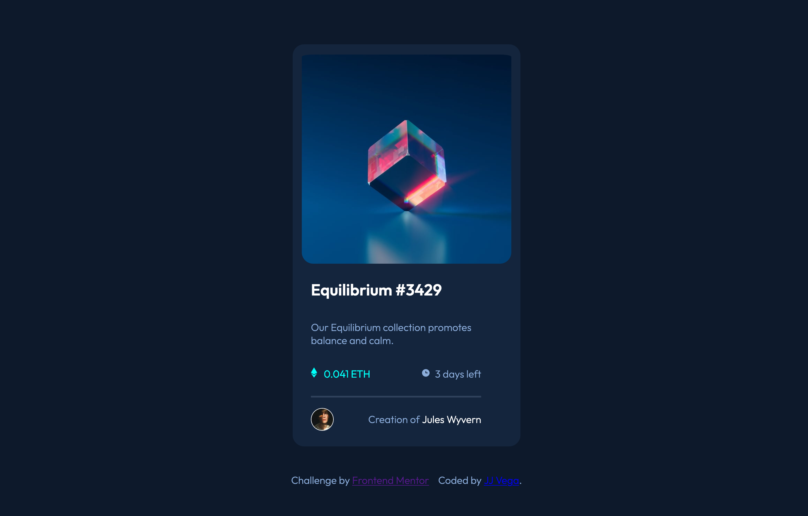

# Frontend Mentor - NFT preview card component solution

This is a solution to the [NFT preview card component challenge on Frontend Mentor](https://www.frontendmentor.io/challenges/nft-preview-card-component-SbdUL_w0U). Frontend Mentor challenges help you improve your coding skills by building realistic projects.

## Table of contents

- [Overview](#overview)
  - [The challenge](#the-challenge)
  - [Screenshot](#screenshot)
  - [Links](#links)
- [My process](#my-process)
  - [Built with](#built-with)
  - [What I learned](#what-i-learned)
  - [Continued development](#continued-development)
- [Author](#author)

## Overview

### The challenge

Users should be able to:

- View the optimal layout depending on their device's screen size
- See hover states for interactive elements

### Screenshot



### Links

- GitHub Repository URL: [CLICK HERE](https://github.com/jjvega86/nft-preview-card-component-main.git)
- Live Site URL: [CLICK HERE](https://jjvega-nft-card-component.netlify.app/)

## My process

I spend most of my time working in React, so the challenge was to get back to basics and do this entirely in HTML and CSS.

I started with writing the design itself, figuring out what the sections of the component would be by drawing boxes around where I thought the most logical grouping of elements would be.

Then, I wrote out all of the semantic HTML, making sure to capture all of the sections I had outlined during the planning phase.

After that, I switched over to writing CSS, starting with defining global CSS variables for the project based on the style guide I received with the challenge.

From there, I worked on the layout, using Flexbox for the entire component and adding Flexbox to some of the sub sections (like the container and footer sections) in order to more easily control spacing and positioning of child elements. I kept the project open in Firefox with the Responsive viewer on and the width set to 375px so I could see how it was fitting the screen based on the design specifications.

After I finished the layout, I worked on the rest of the styling, including colors, typography, and spacing tweaks.

The last step was adding hover states, including the overlay on the Ethereum image and changing font colors for key elements.

### Built with

- Semantic HTML5 markup
- CSS (using CSS variables)
- Flexbox
- Mobile-first workflow
- Visual Studio Code

### What I learned

Some major learnings I gained:

- Using image overlays
  - This was new territory for me, and I enjoyed the challenge of figuring out how to use CSS to control the size of the SVG icon I was using as part of the overlay
- Kevin Powell says it well: "The web is already naturally responsive, our code is what breaks that responsiveness." I learned how to set up my CSS with the correct margin settings in order to allow the component to stay centered on the screen when the sizing changed, and also how to use percentages, relative units, and max/min widths to keep sizing consistent as the screen size changes.
- I learned to not be too much of a perfectionist and to not chase pixel perfection. For example, the footer (with the image of the author and author name) on the design documentation stays in a row format regardless of screen size. I decided to make this a flex container and to change the flex direction to shift to column when the size hit a minimum width (via media query) to stack the image and author name in a column, which I thought ended up looking much more aesthetically pleasing to the eye. It was really fun to take some creative liberties with the design once I got close enough.

To see how you can add code snippets, see below:

```html
<div class="footer">
  
  <p>Creation of <span id="author">Jules Wyvern</span></p>
</div>
```

```css
@media (max-width: 450px) {
  .attribution {
    flex-direction: column;
  }

  .footer {
    flex-direction: column-reverse;
  }
}
```

### Continued development

- I'd like to continue working on the following:
  - Responsive layout. I still feel uncomfortable working mobile first. This particular component didn't change much with the screen size, but getting it to look right proportionally on smaller screen sizes was still a challenge
  - Writing better semantic HTML
    - There's a whole lotta "div" madness happening, which isn't terrible, but I think I could make my HTML a bit more semantic when creating these types of components.
  - Writing more re-usable CSS
    - I think I did well keeping the number of CSS rules down to a minimum and re-using classes when appropriate, but there's definitely room for improvement there.

## Author

- GitHub - [JJ Vega](https://github.com/jjvega86)
- Frontend Mentor - [@jjvega86](https://www.frontendmentor.io/profile/jjvega86)
- LinkedIn - [@jj-vega](https://www.linkedin.com/in/jj-vega/)
